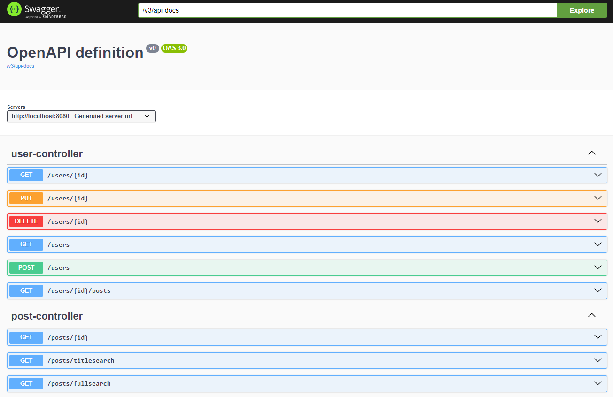

# API REST de Posts e Comentários

Este repositório contém uma API REST desenvolvida com Spring Boot versão 3.3.2, implementando CRUDs completos para gerenciamento de posts, comentários e autores.
A aplicação segue uma arquitetura em camadas, incluindo Controller, Service, Repository, DTO e Entidades.

## Tecnologias Utilizadas

- **Spring Boot 3.3.3**: Framework principal para construção da API.
- **JPA & Hibernate**: Para mapeamento objeto-relacional e persistência de dados.
- **MongoDB**: Banco de dados não relacional utilizado para armazenar os dados.
- **Postman**: Utilizado para testar e validar os endpoints da API.
- **Swagger**: Para documentação interativa dos endpoints da API.

## Estrutura do Projeto

O projeto segue uma arquitetura tradicional em camadas:

- **Controller**: Responsável por receber as requisições HTTP e retornar as respostas.
- **Service**: Contém a lógica de negócios da aplicação.
- **Repository**: Camada de acesso a dados, utilizando Spring Data JPA.
- **Entidades**: Representam os objetos de domínio, mapeados para as tabelas do banco de dados.
- **DTO**: Objetos que carregam dados entre as camadas, garantindo que apenas as informações necessárias sejam expostas ou recebidas nas transações entre cliente e servidor.

## Endpoints Disponíveis 

### Usuários

- **GET /users**: Retorna todos os usuários.
  - **Resposta**: `200 OK`
  ```json
  [
    {
      "id": "66d2133fa2ec5e2902605a83",
      "name": "Maria Brown",
      "email": "maria@gmail.com"
    },
    {
      "id": "66d2133fa2ec5e2902605a84",
      "name": "Alex Green",
      "email": "alex@gmail.com"
    },
    {
      "id": "66d2133fa2ec5e2902605a85",
      "name": "Bob Grey",
      "email": "bob@gmail.com"
    }
  ]

### Posts
- **GET /posts/{id}**: Retorna o post por id.
  - **Resposta**: `200 OK`
  ```json
  {
    "id": "66d214f481f0b976971edb7c",
    "date": "2018-03-21T00:00:00.000+00:00",
    "title": "Partiu viagem",
    "body": "Vou viajar para São Paulo. Abraços!",
    "author": {
      "id": "66d214f481f0b976971edb79",
      "name": "Maria Brown"
    },
    "comments": [
      {
        "text": "Boa Viagem Mano!",
        "date": "2018-03-21T00:00:00.000+00:00",
        "author": {
          "id": "66d214f481f0b976971edb7a",
          "name": "Alex Green"
        }
      },
      {
        "text": "Aproveite",
        "date": "2018-03-22T00:00:00.000+00:00",
        "author": {
          "id": "66d214f481f0b976971edb7b",
          "name": "Bob Grey"
        }
      }
    ]
  }

## Documentação Swagger
A API está documentada utilizando Swagger, permitindo que você explore os endpoints e teste as requisições diretamente do navegador.

- URL de acesso: http://localhost:8080/api  
<br>

## Banco de Dados MongoDB
A aplicação utiliza o banco de dados MongoDB para persistência de dados. Certifique-se de que o MongoDB está configurado e em execução. Abaixo estão as informações necessárias para configurar a aplicação e acessar o MongoDB Compass:

### Configurações de Conexão
- URL de Conexão: mongodb://${MONGODB_HOST:localhost}:27017/<nome_do_banco>
- Usuário do Banco de Dados: (se configurado)
- Senha do Banco de Dados: (se configurado)

### Acesso ao MongoDB Compass
Para visualizar e gerenciar os dados no MongoDB, você pode usar o MongoDB Compass. Abaixo estão as informações de acesso para conectar-se ao banco de dados:

- URL de Conexão: mongodb://localhost:27017
- Nome do Banco de Dados: <nome_do_banco>
- Usuário: (se configurado)
- Senha: (se configurado)
- 
### Para acessar o MongoDB Compass:

- Abra o MongoDB Compass.
- Na tela de conexão, insira a URL de conexão e as credenciais se necessário.
- Clique em "Connect" para acessar o banco de dados e explorar as coleções e documentos.

## Como Executar
1. Clone o repositório:  
   ```bash
   https://github.com/ecalazaes/CRUD-PostsComentarios.git
   
2. Navegue até o diretório do projeto:  
   ```bash
   cd CRUD-PostsComentarios
  
3. Execute o projeto:  
   ```bash
   ./mvnw spring-boot:run

4. Acesse a API no endereço:
   ```bash
   http://localhost:8080/Users 

## Licença

Este projeto está licenciado sob a [MIT License](LICENSE).
